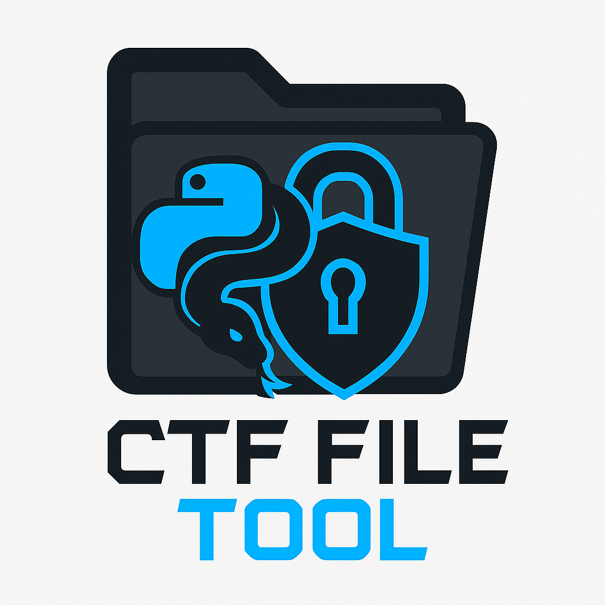

<<<<<<< HEAD
# **CTF File Manipulation Toolkit**  



**Description:**  
This advanced Python script is designed for **CTF (Capture The Flag) players** and **security researchers** to manage, analyze, and clean directories efficiently. It provides:  
✅ **File/folder deletion** (with backup option)  
✅ **File hashing** (MD5, SHA1, SHA256)  
✅ **File metadata extraction** (size, timestamps, MIME type)  
✅ **Pattern-based filtering** (delete only matching files/dirs)  
✅ **Logging & safety features** (exclusions, backups, verbose logging)  

---

## **📌 Installation**  
1. **Install Python 3.x** (if not already installed).  
2. Install required dependencies:  
   ```sh
   pip install python-magic
   ```
   - **Note:** On Linux, you may also need:  
     ```sh
     sudo apt-get install libmagic1  # Debian/Ubuntu
     ```
3. Save the script as **`fileslayer.py`**.

---

## **🛠 Usage**  

### **Basic Syntax**  
```sh
python fileslayer.py [OPTIONS]
```

### **🔹 Common Commands**  

| Command                                               | Description                                                       |
| ----------------------------------------------------- | ----------------------------------------------------------------- |
| `python fileslayer.py`                               | Cleans the current directory (keeps script & backup folder)       |
| `python fileslayer.py -d /path/to/dir`               | Cleans a specific directory                                       |
| `python fileslayer.py -e file1 dir1`                 | Excludes `file1` and `dir1` from deletion                         |
| `python fileslayer.py -fp "*.tmp" "*.log"`           | Deletes only files matching these patterns                        |
| `python fileslayer.py -dp "temp_*"`                  | Deletes only folders matching the pattern                         |
| `python fileslayer.py --info target.txt`             | Shows metadata for `target.txt`                                   |
| `python fileslayer.py --info file.exe --hash sha256` | Computes SHA256 hash of `file.exe`                                |
| `python fileslayer.py -b -v -l log.txt`              | Enables **backup**, **verbose logs**, and saves logs to `log.txt` |

---

## **📂 Example Scenarios**  

### **1. Delete all files except `flag.txt` and `secret/`**  
```sh
python fileslayer.py -e flag.txt secret
```

### **2. Delete only `.tmp` and `.bak` files**  
```sh
python fileslayer.py -fp "*.tmp" "*.bak"
```

### **3. Get file info (size, hash, timestamps, MIME type)**  
```sh
python fileslayer.py --info suspicious_file
```

### **4. Compute SHA1 hash of a file (useful for CTF checks)**  
```sh
python fileslayer.py --info payload --hash sha1
```

### **5. Clean a directory with logging & backups**  
```sh
python fileslayer.py -d /tmp/ctf_challenge -b -v -l ctf_clean.log
```

---

## **⚙️ Safety Features**  
🔹 **Backup mode (`-b`)** → Saves deleted files in `file_manager_backup/`  
🔹 **Exclusion list (`-e`)** → Prevents accidental deletion of critical files  
🔹 **Logging (`-l`)** → Records all operations in a log file  

---

## **🚨 Warning**  
⚠ **This script can delete files permanently!**  
- Always test with `--info` or `-v` first.  
- Use `-b` (backup) when unsure.  

---

## **📝 Summary**  
This tool is **ideal for CTFs** where you need to:  
✔ Quickly clean up challenge directories  
✔ Analyze suspicious files (hashes, MIME types)  
✔ Automate file operations safely  

Try it out in a **test directory first** before running it on important files! 🚀  

--- 

[^1]:  
```

By Solomon Tesfaye (CEH)